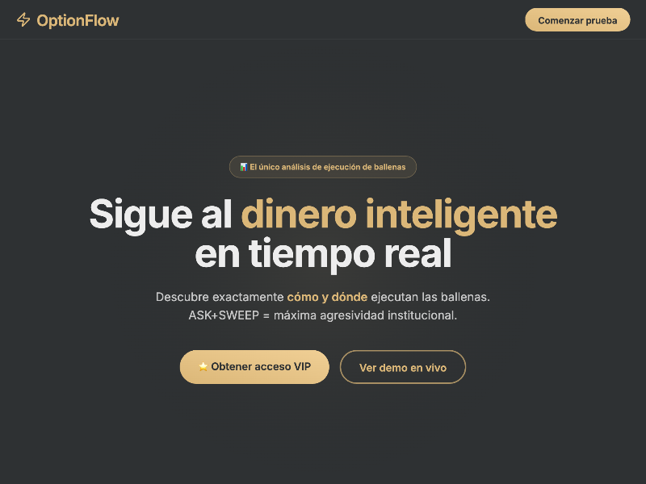

# Real-Time Whale Execution Analytics v5

No description provided.

## 🔗 Links
- **Live Website Demo:** [https://015OVZZ.aura.build/](https://015OVZZ.aura.build/)

## Project Details
- **Slug:** `015OVZZ`
- **Views:** 37
- **Tags:** 
- **Template Type:** Vite-React Project (Compiled from static HTML)

## How to Run
1. Open this folder in your terminal / VS Code.
2. Run `npm install`.
3. Run `npm run dev`.
