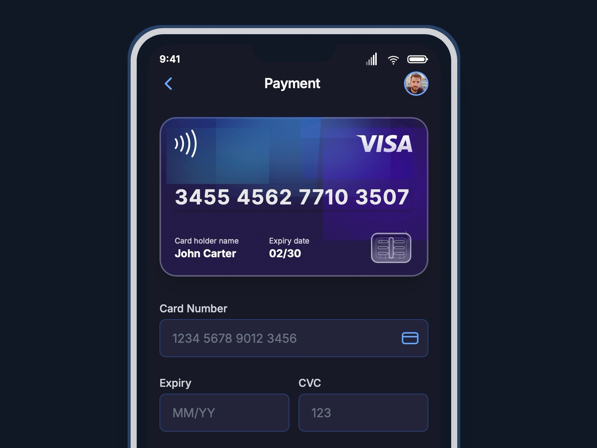

# Mobile Payment Credit Card UI

Responsive mobile payment form with animated mesh gradient credit card and smooth slide-fade animations.

## 🔗 Links
- **Live Website Demo:** [https://02T5E06.aura.build/](https://02T5E06.aura.build/)

## Project Details
- **Slug:** `02T5E06`
- **Views:** 395
- **Tags:** Payment, Credit Card, Mobile UI, Animation, Tailwind CSS, SVG, Form
- **Template Type:** Vite-React Project (Compiled from static HTML)

## How to Run
1. Open this folder in your terminal / VS Code.
2. Run `npm install`.
3. Run `npm run dev`.
