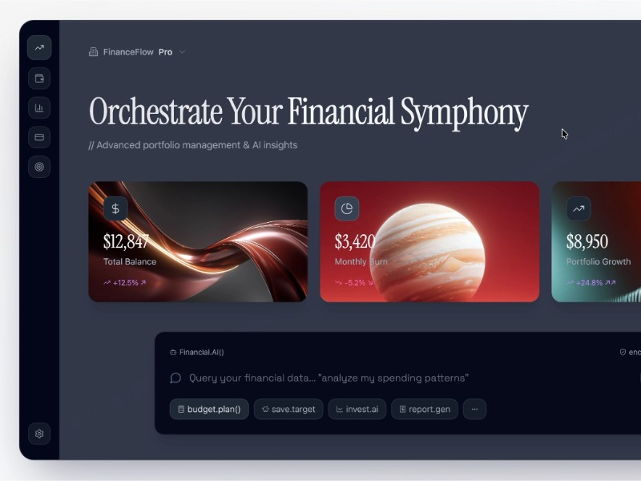

# Financial Dashboard Interface

Responsive financial dashboard UI with dark glassmorphism style, side navigation, animated icons, and multiple font options using Tailwind CSS.

## 🔗 Links
- **Live Website Demo:** [https://03Q7F4Z.aura.build/](https://03Q7F4Z.aura.build/)

## Project Details
- **Slug:** `03Q7F4Z`
- **Views:** 422
- **Tags:** Dashboard, Glassmorphism, Tailwind CSS, Responsive, Navigation, Animation, UI
- **Template Type:** Vite-React Project (Compiled from static HTML)

## How to Run
1. Open this folder in your terminal / VS Code.
2. Run `npm install`.
3. Run `npm run dev`.
