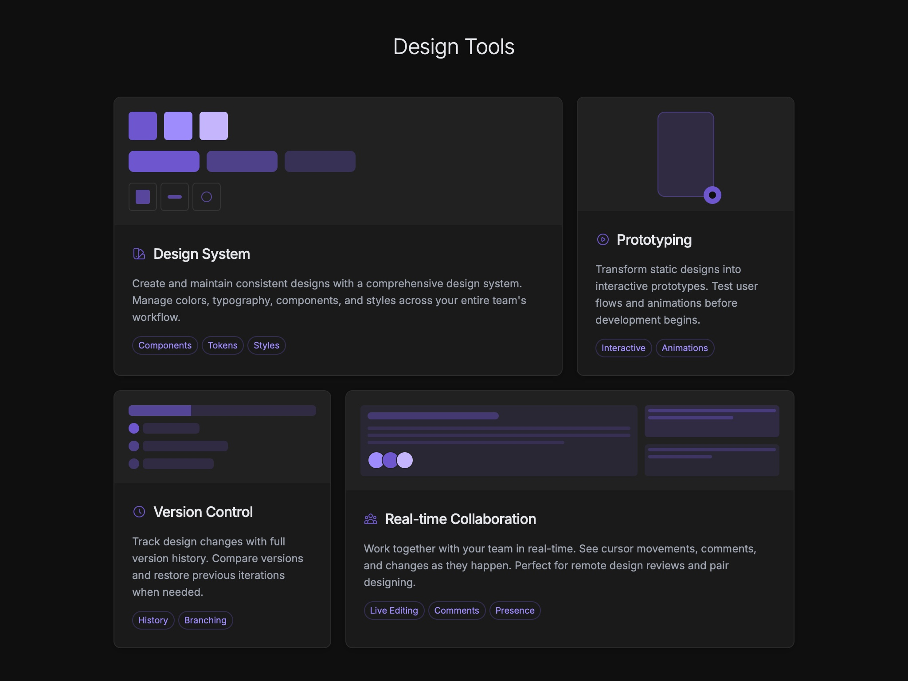

# Design Tools Features Grid

Displays a responsive grid showcasing design tool features like design systems, prototyping, version control with interactive UI cards. Bento.

## 🔗 Links
- **Live Website Demo:** [https://04ZtnM.aura.build/](https://04ZtnM.aura.build/)

## Project Details
- **Slug:** `04ZtnM`
- **Views:** 454
- **Tags:** Features, Design System, Prototyping, Version Control, Responsive, TailwindCSS, UI Components
- **Template Type:** Vite-React Project (Compiled from static HTML)

## How to Run
1. Open this folder in your terminal / VS Code.
2. Run `npm install`.
3. Run `npm run dev`.
