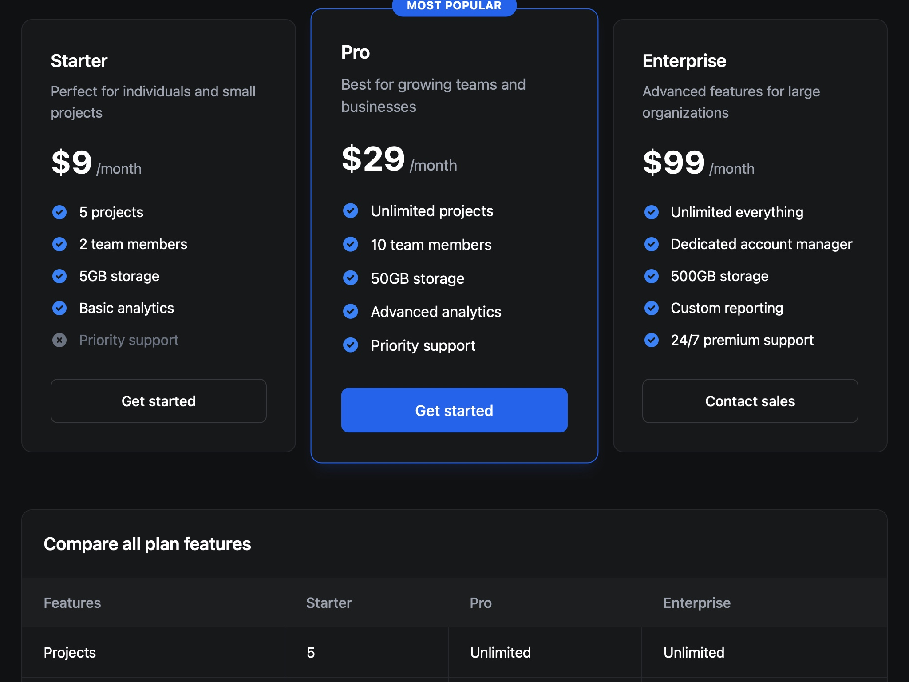

# Pricing Plans with Toggle and Cards

Responsive pricing section with monthly/annual toggle and feature-rich plan cards styled using Tailwind CSS.

## 🔗 Links
- **Live Website Demo:** [https://07oMS6.aura.build/](https://07oMS6.aura.build/)

## Project Details
- **Slug:** `07oMS6`
- **Views:** 846
- **Tags:** Pricing, Toggle, Cards, Tailwind CSS, Responsive, UI
- **Template Type:** Vite-React Project (Compiled from static HTML)

## How to Run
1. Open this folder in your terminal / VS Code.
2. Run `npm install`.
3. Run `npm run dev`.
