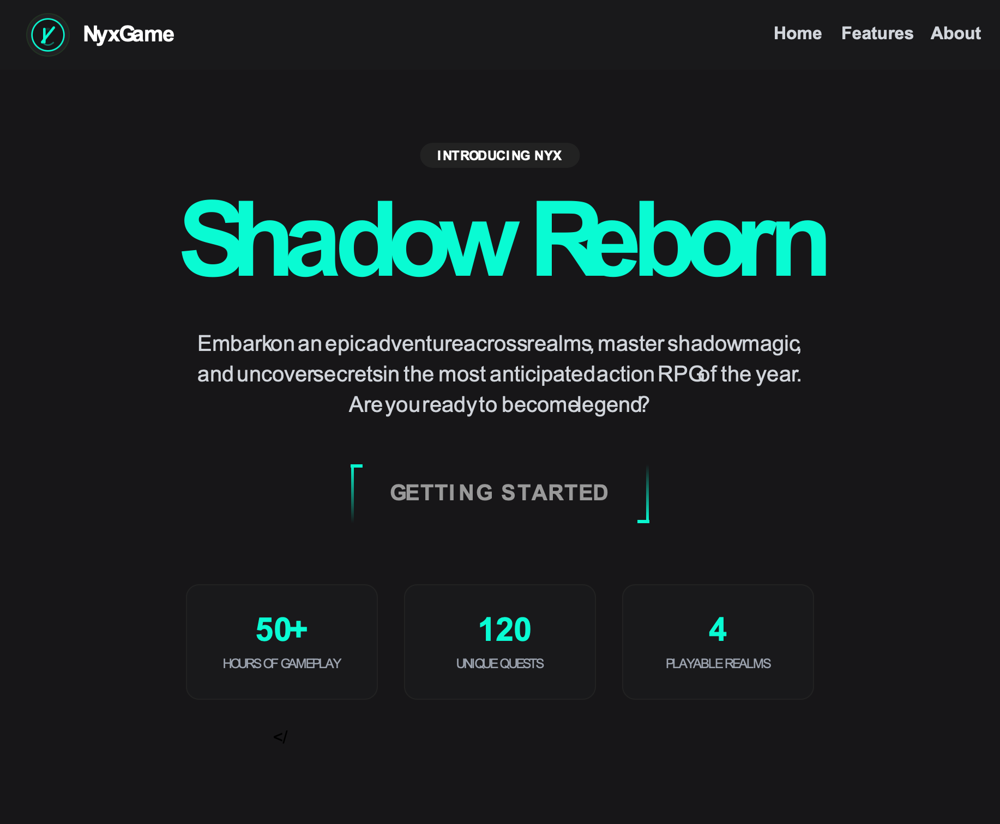

# Interactive RPG Landing Page UI

Responsive landing page with animated button, feature highlights, and a dark-themed RPG game introduction.

## 🔗 Links
- **Live Website Demo:** [https://0AJS74D.aura.build/](https://0AJS74D.aura.build/)

## Project Details
- **Slug:** `0AJS74D`
- **Views:** 182
- **Tags:** Landing Page, Animated Button, Tailwind CSS, Dark Theme, Responsive Design, Features
- **Template Type:** Vite-React Project (Compiled from static HTML)

## How to Run
1. Open this folder in your terminal / VS Code.
2. Run `npm install`.
3. Run `npm run dev`.
