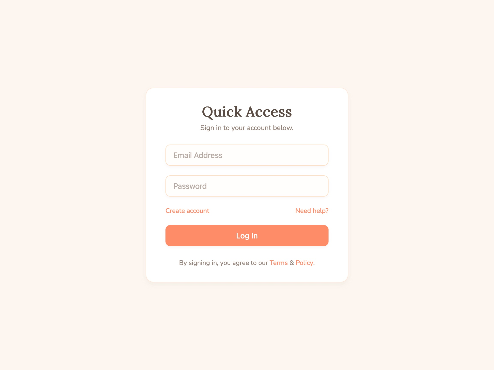

# User Login Form Interface

Responsive login form with email and password inputs, styled buttons, links for account creation and help, and terms notice.

## 🔗 Links
- **Live Website Demo:** [https://0AmOvJh.aura.build/](https://0AmOvJh.aura.build/)

## Project Details
- **Slug:** `0AmOvJh`
- **Views:** 178
- **Tags:** Login Form, Responsive Design, CSS Variables, Form Validation, User Authentication UI
- **Template Type:** Vite-React Project (Compiled from static HTML)

## How to Run
1. Open this folder in your terminal / VS Code.
2. Run `npm install`.
3. Run `npm run dev`.
