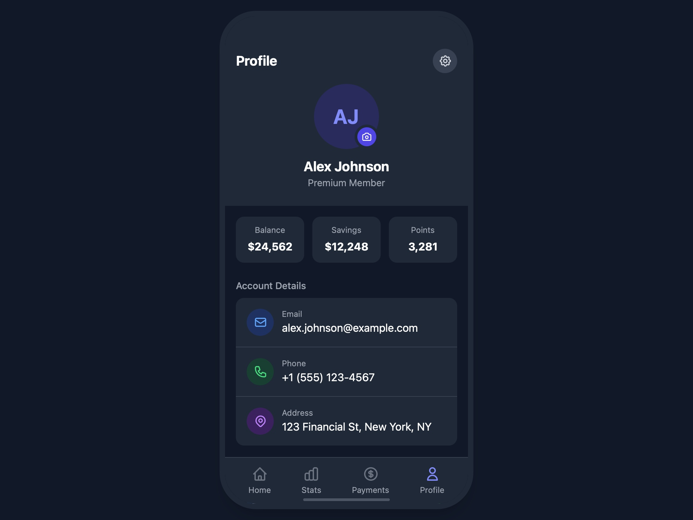

# User Profile and Account Overview

Responsive user profile UI displaying personal info, account stats, details, and linked social accounts with dark theme styling.

## 🔗 Links
- **Live Website Demo:** [https://0E7RSw.aura.build/](https://0E7RSw.aura.build/)

## Project Details
- **Slug:** `0E7RSw`
- **Views:** 405
- **Tags:** Profile, Account Overview, Tailwind CSS, Responsive Design, Dark Mode, User Interface
- **Template Type:** Vite-React Project (Compiled from static HTML)

## How to Run
1. Open this folder in your terminal / VS Code.
2. Run `npm install`.
3. Run `npm run dev`.
