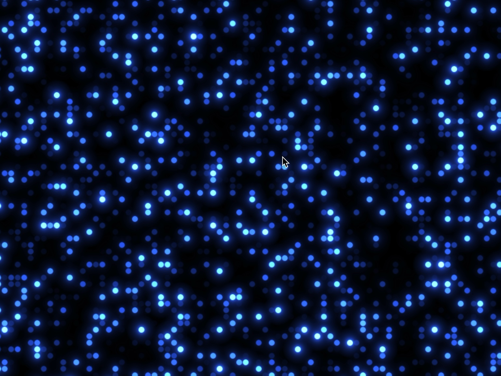

# Fullscreen WebGL Shader Canvas

Renders a dynamic fullscreen shader animation using Three.js with custom GLSL vertex and fragment shaders.

## 🔗 Links
- **Live Website Demo:** [https://0F2MHG2.aura.build/](https://0F2MHG2.aura.build/)

## Project Details
- **Slug:** `0F2MHG2`
- **Views:** 504
- **Tags:** Shader, WebGL, Three.js, GLSL, Animation, Canvas, Fullscreen
- **Template Type:** Vite-React Project (Compiled from static HTML)

## How to Run
1. Open this folder in your terminal / VS Code.
2. Run `npm install`.
3. Run `npm run dev`.
