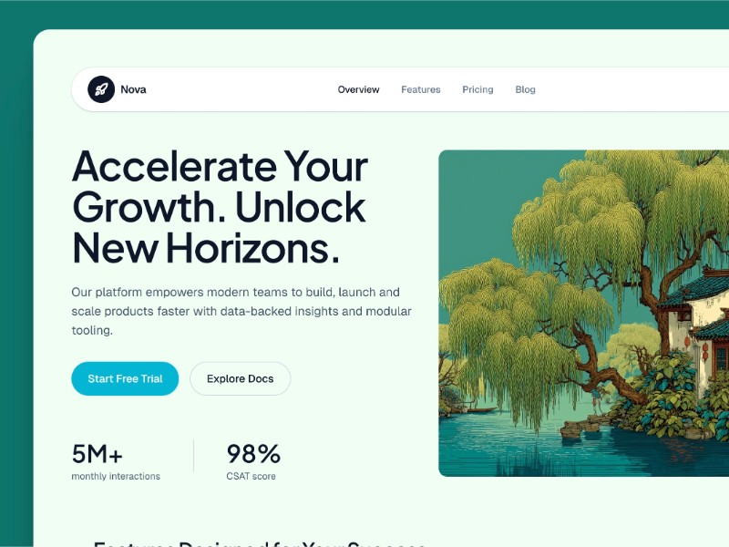

# Responsive Navigation Bar UI

HTML and Tailwind CSS code for a responsive navigation bar with logo, menu links, mobile toggle, and call-to-action button.

## 🔗 Links
- **Live Website Demo:** [https://0GTQ3CS.aura.build/](https://0GTQ3CS.aura.build/)

## Project Details
- **Slug:** `0GTQ3CS`
- **Views:** 2414
- **Tags:** Navigation, Responsive, Tailwind CSS, Mobile Menu, UI, Web Design
- **Template Type:** Vite-React Project (Compiled from static HTML)

## How to Run
1. Open this folder in your terminal / VS Code.
2. Run `npm install`.
3. Run `npm run dev`.
