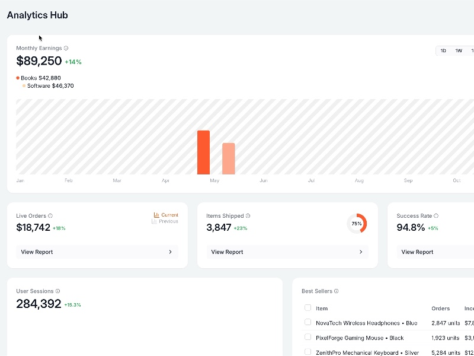

# Analytics Dashboard Layout

Responsive dashboard UI displaying earnings, live orders, shipment stats, success rate, and interactive charts using Tailwind CSS.

## 🔗 Links
- **Live Website Demo:** [https://0H4AJFP.aura.build/](https://0H4AJFP.aura.build/)

## Project Details
- **Slug:** `0H4AJFP`
- **Views:** 484
- **Tags:** Dashboard, Tailwind CSS, Responsive Design, Data Visualization, UI Components, Charts, Statistics
- **Template Type:** Vite-React Project (Compiled from static HTML)

## How to Run
1. Open this folder in your terminal / VS Code.
2. Run `npm install`.
3. Run `npm run dev`.
