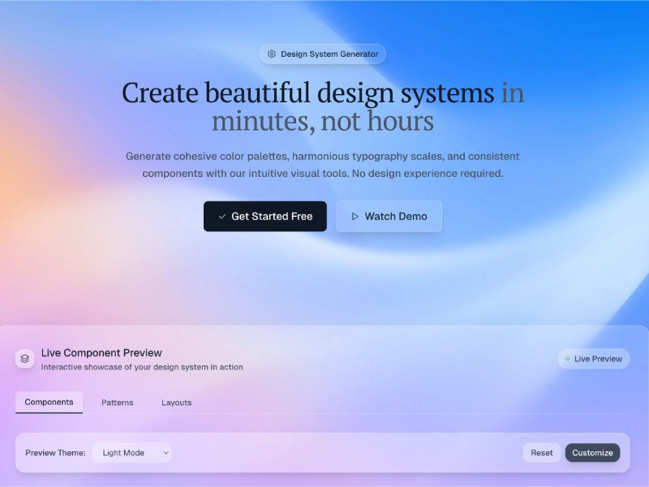

# Responsive Navigation with Background

HTML code for a responsive navigation bar with background image, custom fonts, and styled buttons using Tailwind CSS.

## 🔗 Links
- **Live Website Demo:** [https://0HQSXOS.aura.build/](https://0HQSXOS.aura.build/)

## Project Details
- **Slug:** `0HQSXOS`
- **Views:** 558
- **Tags:** Navigation, Responsive, Tailwind CSS, Background Image, Custom Fonts, UI
- **Template Type:** Vite-React Project (Compiled from static HTML)

## How to Run
1. Open this folder in your terminal / VS Code.
2. Run `npm install`.
3. Run `npm run dev`.
