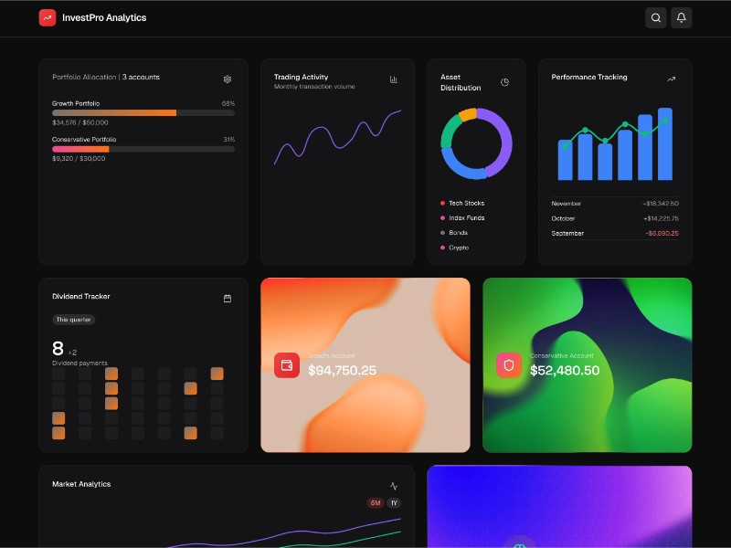

# Investment Portfolio Analytics Dashboard

Responsive dashboard UI displaying investment data with interactive charts, notifications, and search using Tailwind CSS and Chart.js.

## 🔗 Links
- **Live Website Demo:** [https://0HSQAXA.aura.build/](https://0HSQAXA.aura.build/)

## Project Details
- **Slug:** `0HSQAXA`
- **Views:** 438
- **Tags:** Dashboard, Portfolio, Chart.js, Tailwind CSS, Animations, Responsive Design, UI
- **Template Type:** Vite-React Project (Compiled from static HTML)

## How to Run
1. Open this folder in your terminal / VS Code.
2. Run `npm install`.
3. Run `npm run dev`.
