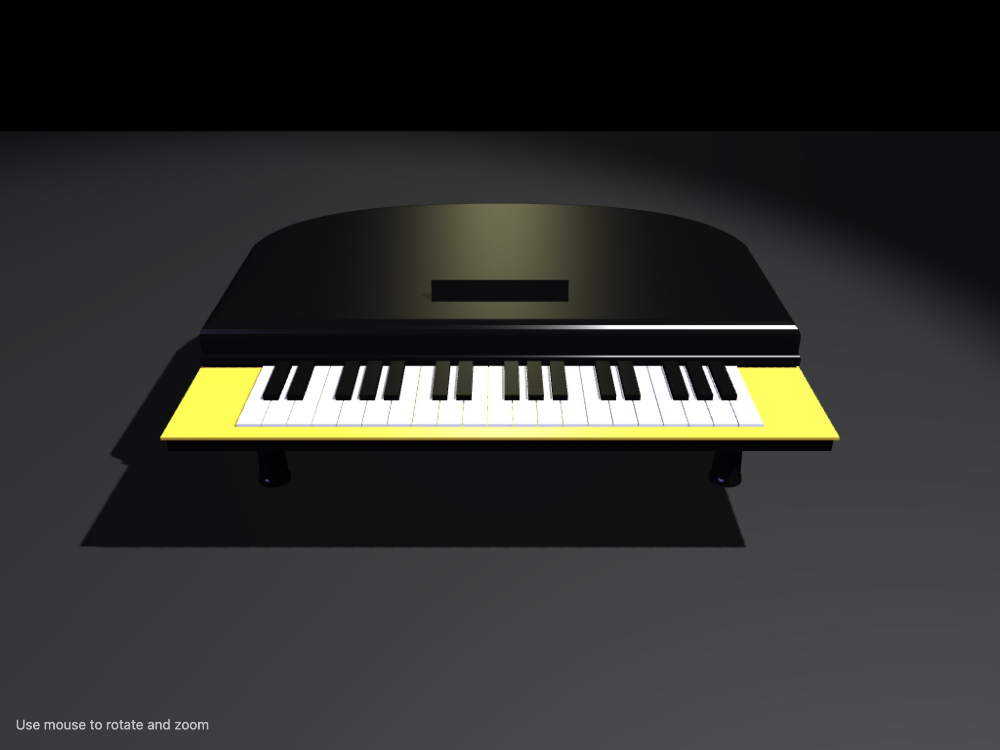

# 3D Interactive Grand Piano Model

Renders an interactive 3D grand piano with detailed geometry, lighting, and orbit controls using Three.js and WebGL.

## 🔗 Links
- **Live Website Demo:** [https://0IgBB6W.aura.build/](https://0IgBB6W.aura.build/)

## Project Details
- **Slug:** `0IgBB6W`
- **Views:** 112
- **Tags:** 3D Model, Three.js, WebGL, Interactive, Piano, Lighting, OrbitControls
- **Template Type:** Vite-React Project (Compiled from static HTML)

## How to Run
1. Open this folder in your terminal / VS Code.
2. Run `npm install`.
3. Run `npm run dev`.
