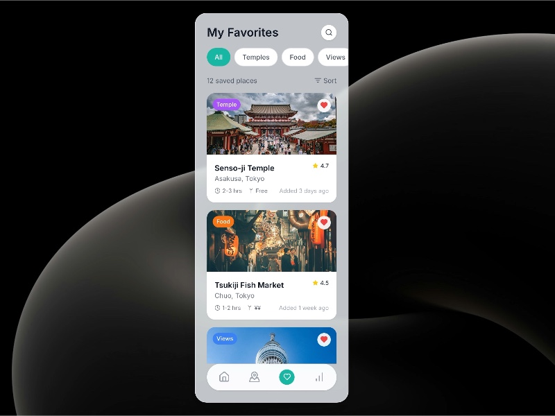

# Favorites List with Filters and Stats

UI displaying a scrollable list of saved favorite places with category filters, sorting options, and detailed place cards.

## 🔗 Links
- **Live Website Demo:** [https://0PHRQ4F.aura.build/](https://0PHRQ4F.aura.build/)

## Project Details
- **Slug:** `0PHRQ4F`
- **Views:** 146
- **Tags:** Favorites, Filters, Scrollable List, Cards, Tailwind CSS, Location UI, Ratings
- **Template Type:** Vite-React Project (Compiled from static HTML)

## How to Run
1. Open this folder in your terminal / VS Code.
2. Run `npm install`.
3. Run `npm run dev`.
