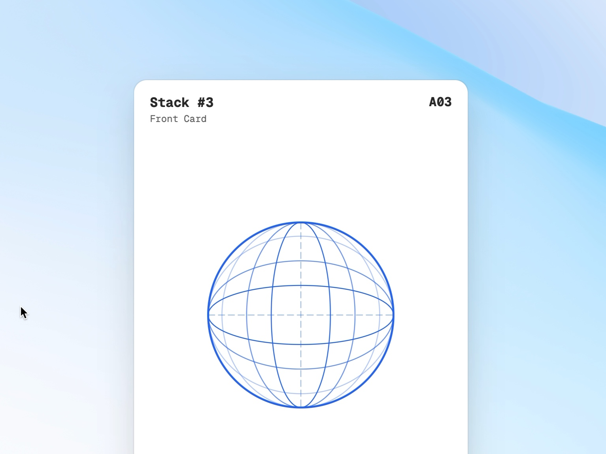

# Interactive 3D Stacked Sphere Cards

Displays a 3D perspective stack of interactive sphere-themed cards with layered shadows and a dynamic background.

## 🔗 Links
- **Live Website Demo:** [https://0QZ8ZCK.aura.build/](https://0QZ8ZCK.aura.build/)

## Project Details
- **Slug:** `0QZ8ZCK`
- **Views:** 267
- **Tags:** 3D Cards, Interactive UI, Stacked Layout, SVG Graphics, Tailwind CSS, Perspective Effect
- **Template Type:** Vite-React Project (Compiled from static HTML)

## How to Run
1. Open this folder in your terminal / VS Code.
2. Run `npm install`.
3. Run `npm run dev`.
