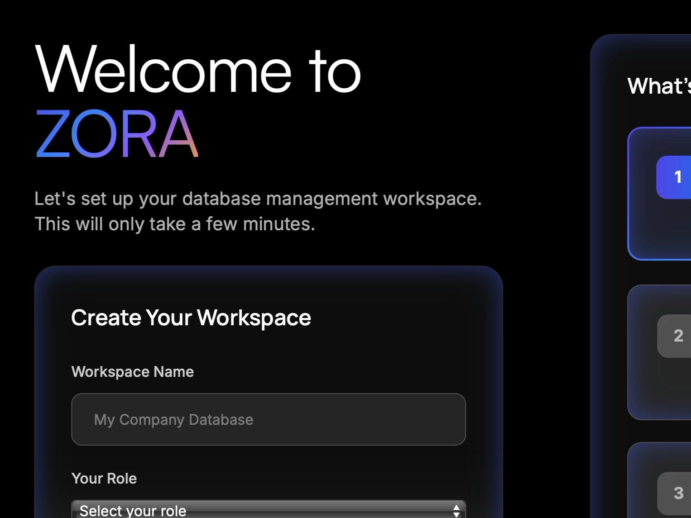

# Onboarding Setup Interface

Responsive onboarding UI with progress bar and workspace setup form using Tailwind CSS and custom animations.

## 🔗 Links
- **Live Website Demo:** [https://0S505XN.aura.build/](https://0S505XN.aura.build/)

## Project Details
- **Slug:** `0S505XN`
- **Views:** 264
- **Tags:** Onboarding, Progress Bar, Form, Tailwind CSS, Animation, Responsive Design, UI
- **Template Type:** Vite-React Project (Compiled from static HTML)

## How to Run
1. Open this folder in your terminal / VS Code.
2. Run `npm install`.
3. Run `npm run dev`.
