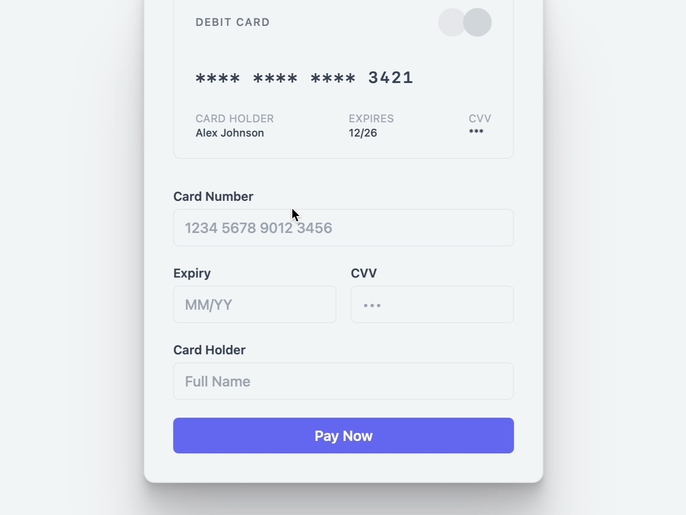

# Payment Card Input Interface

UI for entering and previewing debit card details with a styled form and live card preview using Tailwind CSS.

## 🔗 Links
- **Live Website Demo:** [https://0SSZ8F5.aura.build/](https://0SSZ8F5.aura.build/)

## Project Details
- **Slug:** `0SSZ8F5`
- **Views:** 187
- **Tags:** Payment Form, Card Preview, Tailwind CSS, Input Validation, Responsive Design
- **Template Type:** Vite-React Project (Compiled from static HTML)

## How to Run
1. Open this folder in your terminal / VS Code.
2. Run `npm install`.
3. Run `npm run dev`.
