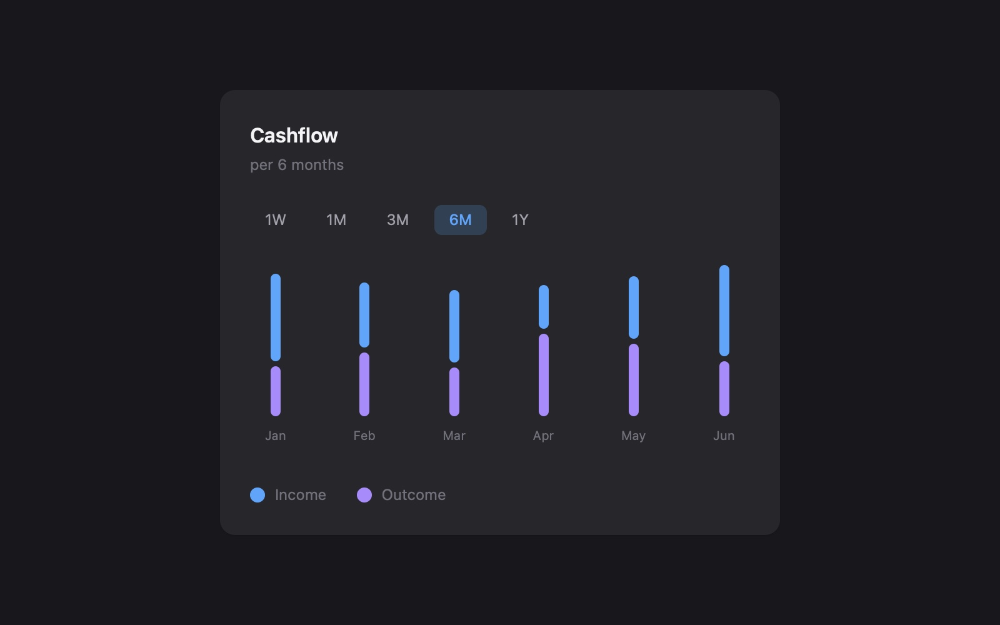

# Cashflow Data Visualization Card

Interactive cashflow bar chart showing income and outcome over selectable time periods using Tailwind CSS.

## 🔗 Links
- **Live Website Demo:** [https://0bBKsX1b.aura.build/](https://0bBKsX1b.aura.build/)

## Project Details
- **Slug:** `0bBKsX1b`
- **Views:** 161
- **Tags:** JavaScript, Tailwind CSS, Bar Chart, Interactive UI, Responsive Design
- **Template Type:** Vite-React Project (Compiled from static HTML)

## How to Run
1. Open this folder in your terminal / VS Code.
2. Run `npm install`.
3. Run `npm run dev`.
