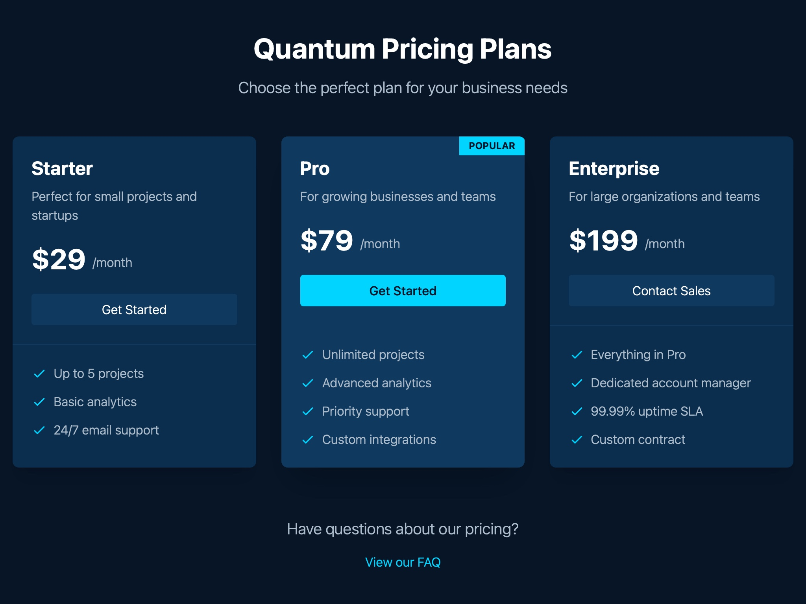

# Pricing Plans Interface

Responsive pricing cards UI showcasing tiered plans with features, pricing, and call-to-action buttons using Tailwind CSS.

## 🔗 Links
- **Live Website Demo:** [https://0fyUK51.aura.build/](https://0fyUK51.aura.build/)

## Project Details
- **Slug:** `0fyUK51`
- **Views:** 50
- **Tags:** Pricing, Cards, Tailwind CSS, Responsive, Features, Call-to-Action
- **Template Type:** Vite-React Project (Compiled from static HTML)

## How to Run
1. Open this folder in your terminal / VS Code.
2. Run `npm install`.
3. Run `npm run dev`.
