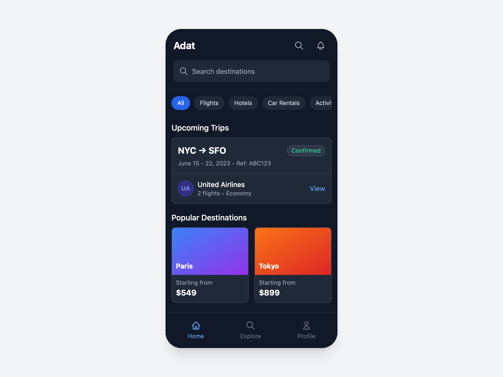

# Travel Booking Interface

Responsive travel booking UI with search, categories, upcoming trips, popular destinations, recent searches, and bottom navigation.

## 🔗 Links
- **Live Website Demo:** [https://0iu8JV.aura.build/](https://0iu8JV.aura.build/)

## Project Details
- **Slug:** `0iu8JV`
- **Views:** 145
- **Tags:** Booking UI, Travel, Tailwind CSS, Responsive Design, Search, Navigation, Upcoming Trips
- **Template Type:** Vite-React Project (Compiled from static HTML)

## How to Run
1. Open this folder in your terminal / VS Code.
2. Run `npm install`.
3. Run `npm run dev`.
