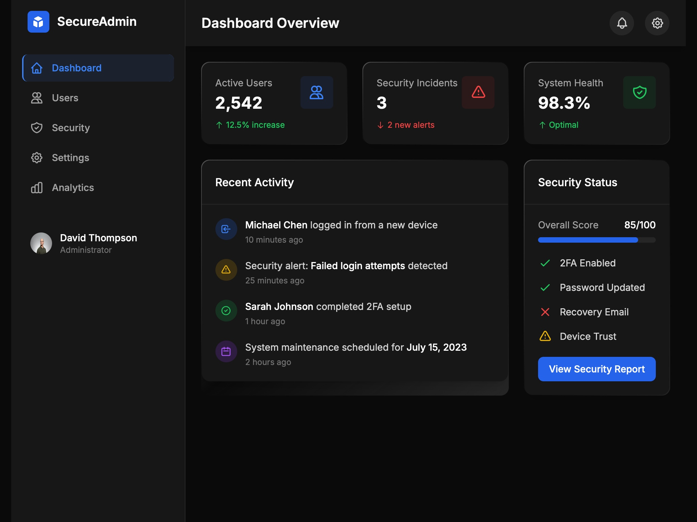

# Admin Dashboard with Sidebar UI

Responsive admin dashboard layout featuring a sidebar navigation, user profile, and top header using Tailwind CSS.

## 🔗 Links
- **Live Website Demo:** [https://0jtaWE.aura.build/](https://0jtaWE.aura.build/)

## Project Details
- **Slug:** `0jtaWE`
- **Views:** 745
- **Tags:** Dashboard, Sidebar, Tailwind CSS, Responsive, Navigation, User Profile, Web UI
- **Template Type:** Vite-React Project (Compiled from static HTML)

## How to Run
1. Open this folder in your terminal / VS Code.
2. Run `npm install`.
3. Run `npm run dev`.
