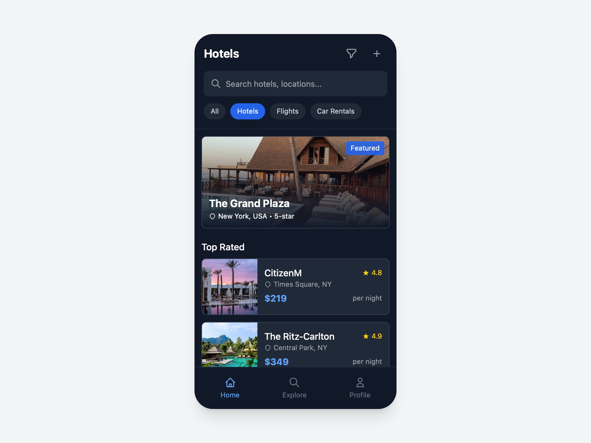

# Hotel Listings and Deals UI

Responsive hotel listings interface with search, filters, featured section, top rated hotels, and best deals using Tailwind CSS.

## 🔗 Links
- **Live Website Demo:** [https://0khxTxw3.aura.build/](https://0khxTxw3.aura.build/)

## Project Details
- **Slug:** `0khxTxw3`
- **Views:** 139
- **Tags:** Hotel Listings, Search, Filters, Featured Section, Top Rated, Best Deals, Tailwind CSS
- **Template Type:** Vite-React Project (Compiled from static HTML)

## How to Run
1. Open this folder in your terminal / VS Code.
2. Run `npm install`.
3. Run `npm run dev`.
