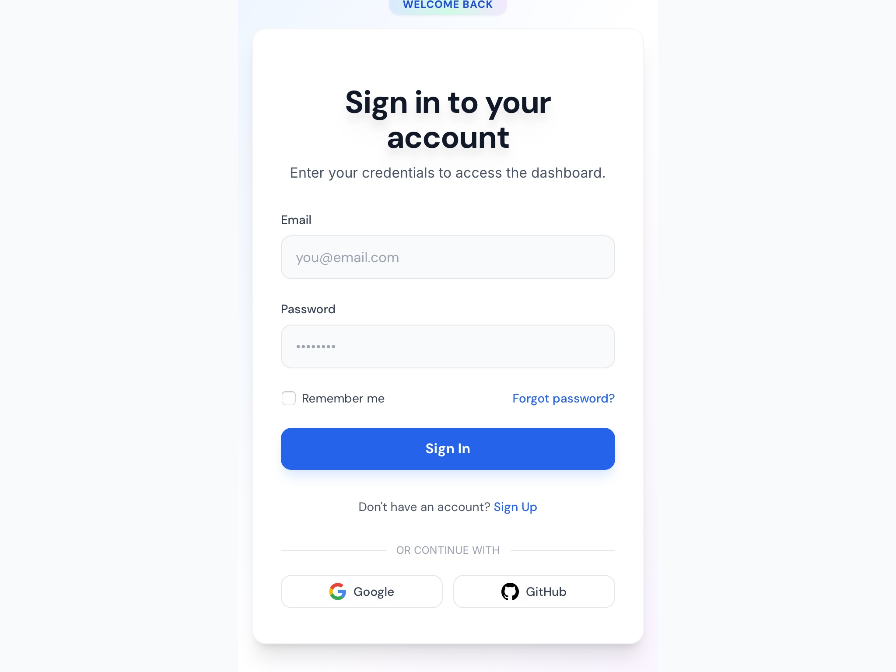

# User Account Sign-In Interface

Responsive login form with email, password, remember option, social sign-in buttons, and dark mode support.

## 🔗 Links
- **Live Website Demo:** [https://0reNWl.aura.build/](https://0reNWl.aura.build/)

## Project Details
- **Slug:** `0reNWl`
- **Views:** 126
- **Tags:** Login, Authentication, Responsive, Dark Mode, Tailwind CSS, Social Sign-In, Form
- **Template Type:** Vite-React Project (Compiled from static HTML)

## How to Run
1. Open this folder in your terminal / VS Code.
2. Run `npm install`.
3. Run `npm run dev`.
