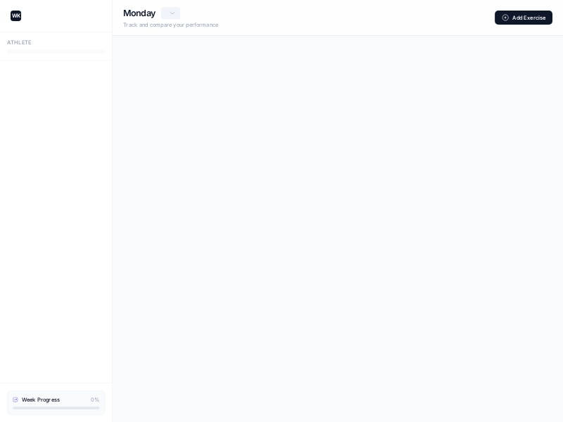

# Workout Tracker Dashboard Template

A modern workout tracker dashboard template for logging sets, reps, and weekly progress across athletes and weeks, ready to customize for your fitness app.

## 🔗 Links
- **Live Website Demo:** [https://100-days-challange.aura.build/](https://100-days-challange.aura.build/)

## Project Details
- **Slug:** `100-days-challange`
- **Views:** 22
- **Tags:** Health, Technology, Landing Page, Clean, Minimal, Brand, Fitness, Workout Tracker, Dashboard UI, Tailwind CSS
- **Template Type:** Vite-React Project (Compiled from static HTML)

## How to Run
1. Open this folder in your terminal / VS Code.
2. Run `npm install`.
3. Run `npm run dev`.
