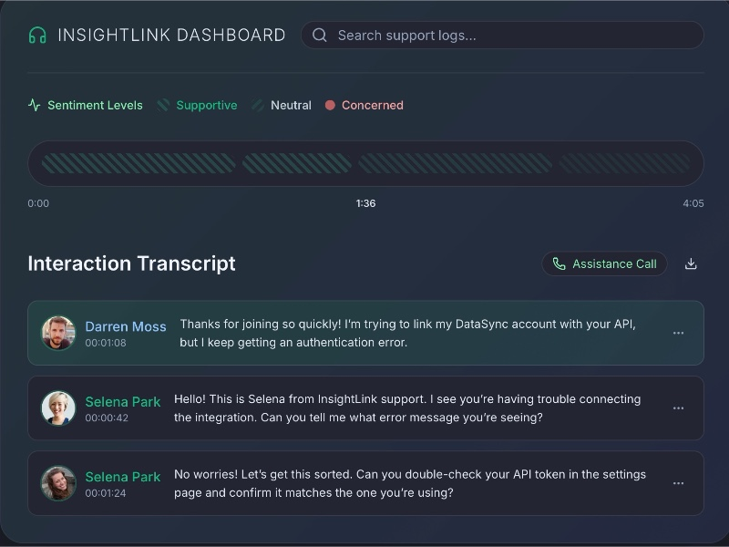

# Support Interaction Transcript UI

Displays a searchable support call dashboard with sentiment legend, timeline scrubber, and detailed interaction transcripts.

## 🔗 Links
- **Live Website Demo:** [https://10LT430.aura.build/](https://10LT430.aura.build/)

## Project Details
- **Slug:** `10LT430`
- **Views:** 161
- **Tags:** Support Dashboard, Interaction Transcript, Sentiment Analysis, Timeline Scrubber, Tailwind CSS, Responsive UI
- **Template Type:** Vite-React Project (Compiled from static HTML)

## How to Run
1. Open this folder in your terminal / VS Code.
2. Run `npm install`.
3. Run `npm run dev`.
