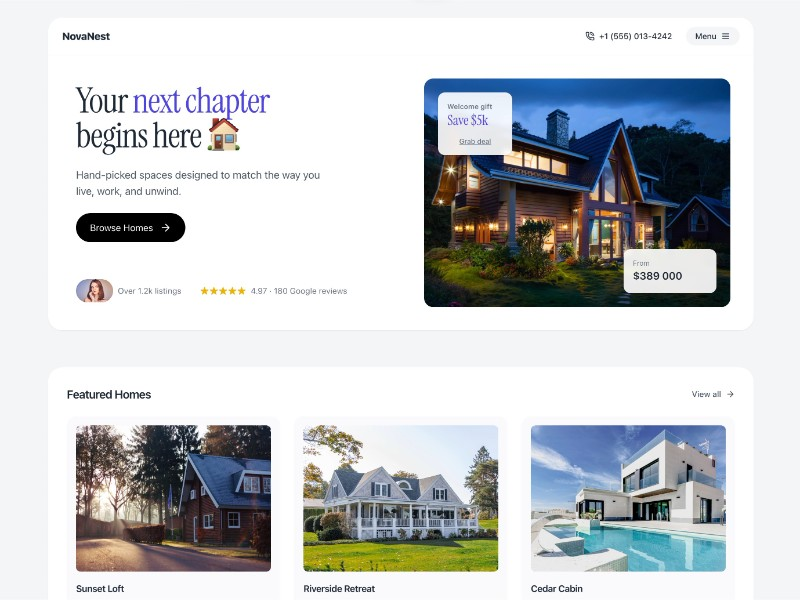

# Responsive Website Header and Hero

HTML code for a responsive website header with contact info, menu buttons, and a hero section featuring a large headline.

## 🔗 Links
- **Live Website Demo:** [https://10VWKO6.aura.build/](https://10VWKO6.aura.build/)

## Project Details
- **Slug:** `10VWKO6`
- **Views:** 998
- **Tags:** Header, Hero, Responsive, Tailwind CSS, SVG Icons, Typography
- **Template Type:** Vite-React Project (Compiled from static HTML)

## How to Run
1. Open this folder in your terminal / VS Code.
2. Run `npm install`.
3. Run `npm run dev`.
