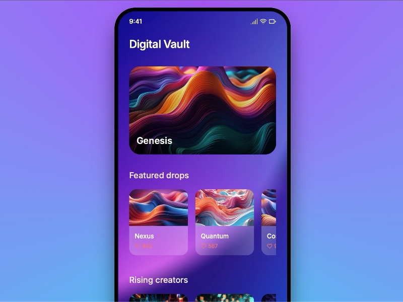

# Mobile Interface with Featured Collections

Responsive mobile UI showcasing a digital vault with featured image drops and trending collections using Tailwind CSS and SVG icons.

## 🔗 Links
- **Live Website Demo:** [https://1389SBT.aura.build/](https://1389SBT.aura.build/)

## Project Details
- **Slug:** `1389SBT`
- **Views:** 348
- **Tags:** Mobile UI, Featured Collections, Tailwind CSS, Responsive Design, SVG Icons, Animation
- **Template Type:** Vite-React Project (Compiled from static HTML)

## How to Run
1. Open this folder in your terminal / VS Code.
2. Run `npm install`.
3. Run `npm run dev`.
