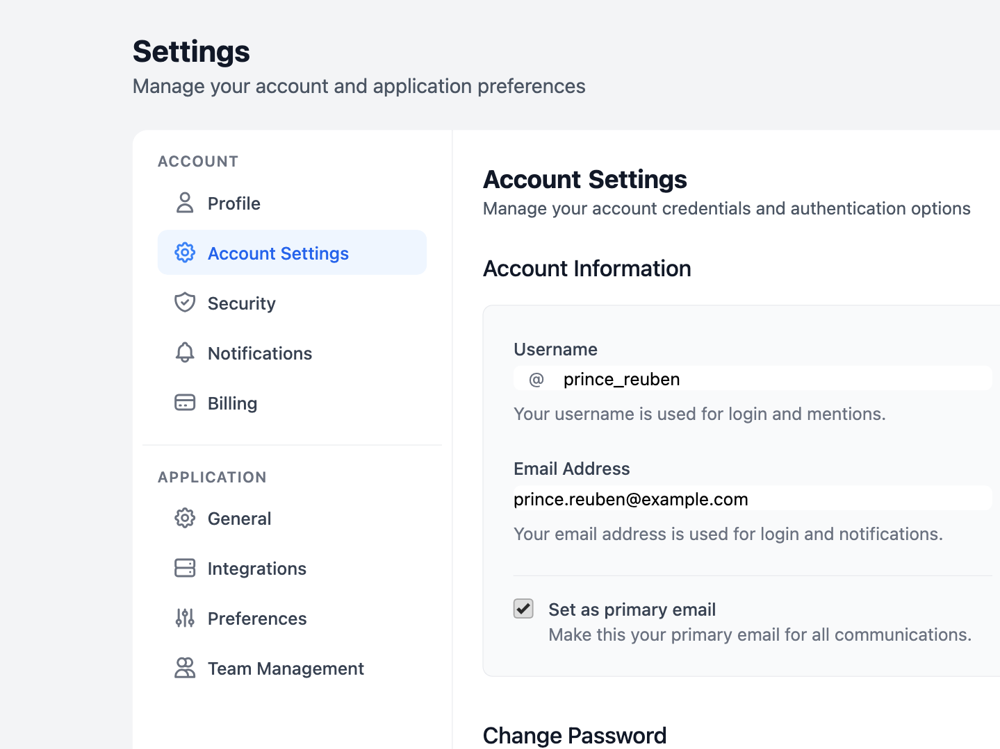

# Account and Application Settings Panel v24

No description provided.

## 🔗 Links
- **Live Website Demo:** [https://1721AKC.aura.build/](https://1721AKC.aura.build/)

## Project Details
- **Slug:** `1721AKC`
- **Views:** 26
- **Tags:** 
- **Template Type:** Vite-React Project (Compiled from static HTML)

## How to Run
1. Open this folder in your terminal / VS Code.
2. Run `npm install`.
3. Run `npm run dev`.
