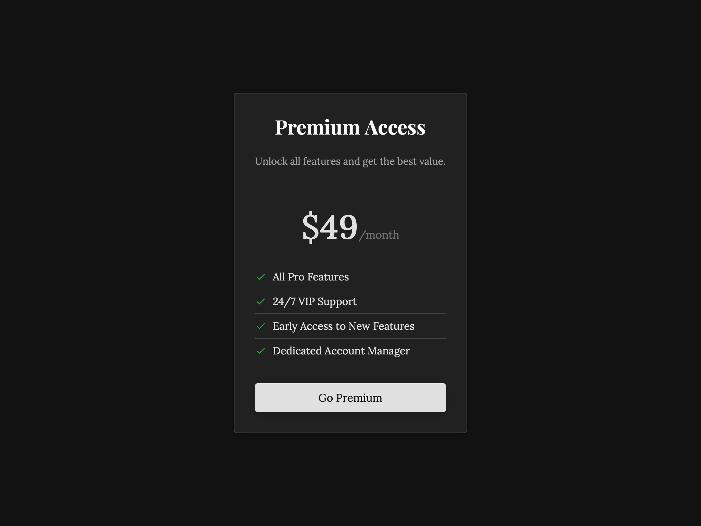

# Subscription Pricing Plan UI

Dark-themed pricing plan card showcasing premium subscription details with features and call-to-action button.

## 🔗 Links
- **Live Website Demo:** [https://19o3yh.aura.build/](https://19o3yh.aura.build/)

## Project Details
- **Slug:** `19o3yh`
- **Views:** 46
- **Tags:** Pricing, Subscription, Features, Dark Mode, UI Component, Call-to-Action, CSS Transitions
- **Template Type:** Vite-React Project (Compiled from static HTML)

## How to Run
1. Open this folder in your terminal / VS Code.
2. Run `npm install`.
3. Run `npm run dev`.
