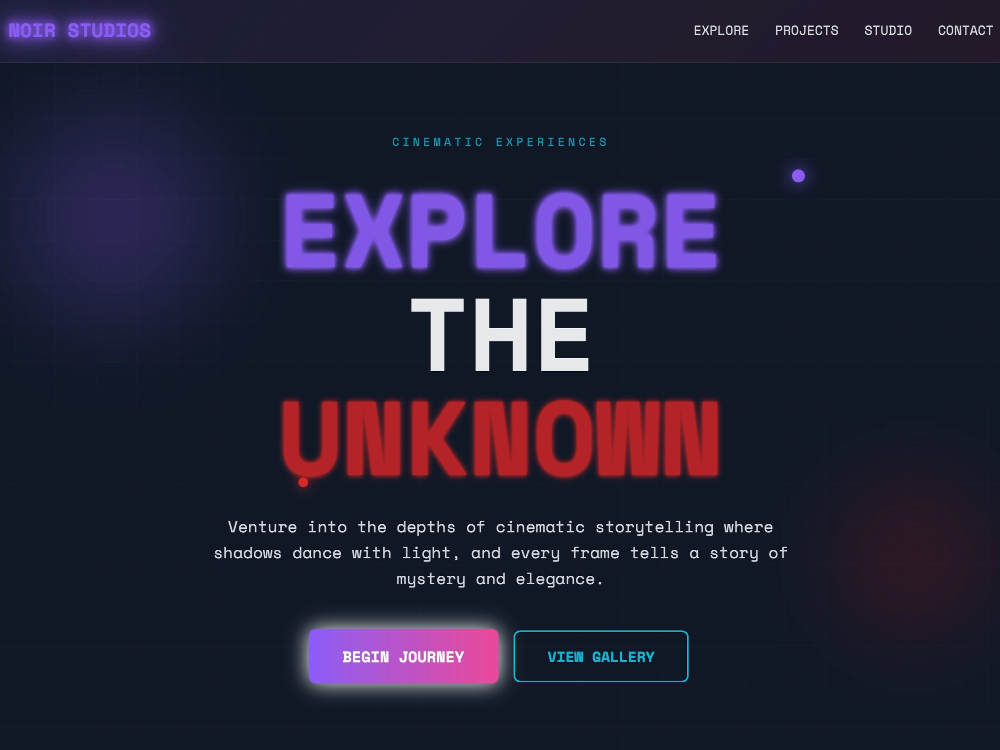

# Cinematic Neon Exploration UI

A neon-themed webpage featuring a hero section, floating elements, and an exploration grid with animated cards.

## 🔗 Links
- **Live Website Demo:** [https://1B18TMM.aura.build/](https://1B18TMM.aura.build/)

## Project Details
- **Slug:** `1B18TMM`
- **Views:** 99
- **Tags:** Hero, Exploration Grid, Neon Effects, Tailwind CSS, Animation, Floating Elements, UI Design
- **Template Type:** Vite-React Project (Compiled from static HTML)

## How to Run
1. Open this folder in your terminal / VS Code.
2. Run `npm install`.
3. Run `npm run dev`.
