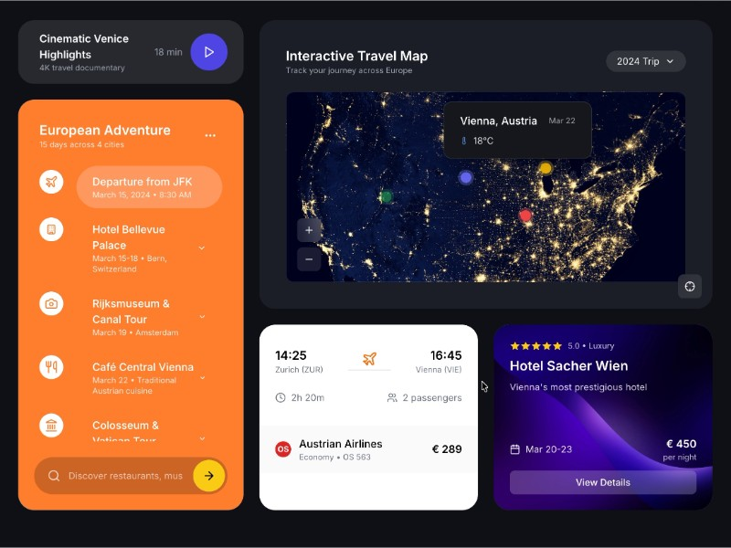

# Travel Itinerary and Video Player UI

Displays a travel video preview and an interactive multi-day trip itinerary with timeline and activity details.

## 🔗 Links
- **Live Website Demo:** [https://1DA1IQP.aura.build/](https://1DA1IQP.aura.build/)

## Project Details
- **Slug:** `1DA1IQP`
- **Views:** 465
- **Tags:** Travel Itinerary, Video Card, Timeline, Tailwind CSS, Responsive Layout, Interactive List
- **Template Type:** Vite-React Project (Compiled from static HTML)

## How to Run
1. Open this folder in your terminal / VS Code.
2. Run `npm install`.
3. Run `npm run dev`.
