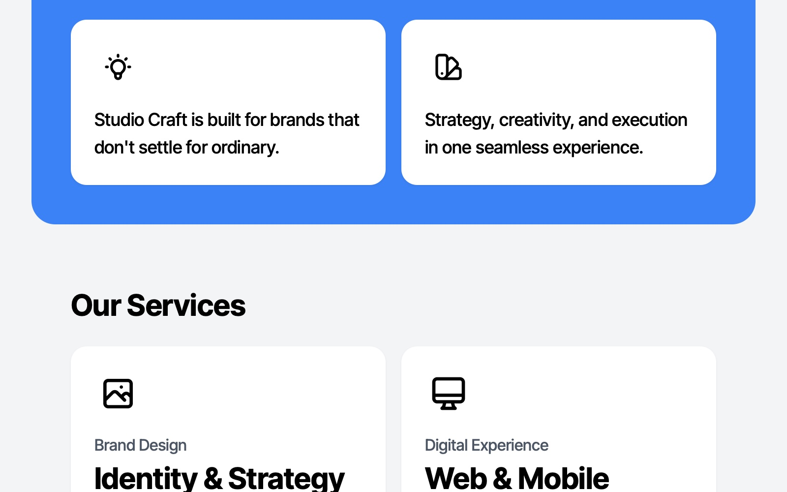

# Brand Design and Digital Services UI

Responsive UI showcasing brand design and digital experience services with Tailwind CSS and custom icons.

## 🔗 Links
- **Live Website Demo:** [https://1DvTa3hF.aura.build/](https://1DvTa3hF.aura.build/)

## Project Details
- **Slug:** `1DvTa3hF`
- **Views:** 132
- **Tags:** HTML, Tailwind CSS, Responsive Design, UI Design, Web Development, SVG Icons
- **Template Type:** Vite-React Project (Compiled from static HTML)

## How to Run
1. Open this folder in your terminal / VS Code.
2. Run `npm install`.
3. Run `npm run dev`.
