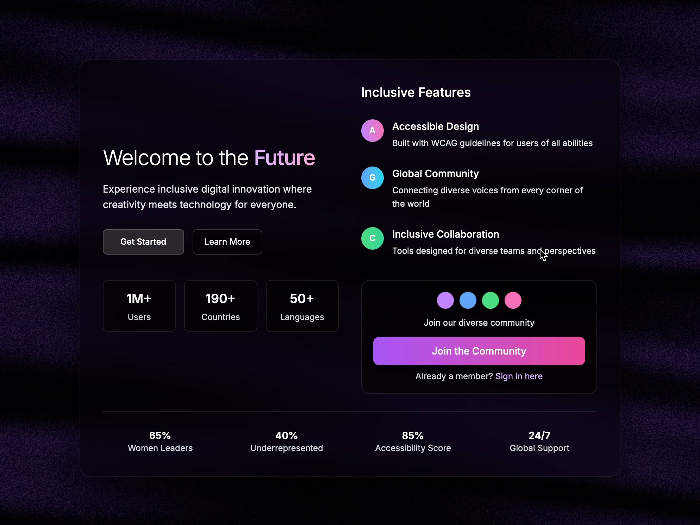

# Digital Innovation Landing Section

Landing page with glassmorphic UI featuring user stats, inclusive features, and interactive buttons over 3D canvas background.

## 🔗 Links
- **Live Website Demo:** [https://1F24WQ3.aura.build/](https://1F24WQ3.aura.build/)

## Project Details
- **Slug:** `1F24WQ3`
- **Views:** 585
- **Tags:** Glassmorphism, Landing Page, Inclusive Features, User Stats, Tailwind CSS, Three.js, Responsive Design
- **Template Type:** Vite-React Project (Compiled from static HTML)

## How to Run
1. Open this folder in your terminal / VS Code.
2. Run `npm install`.
3. Run `npm run dev`.
