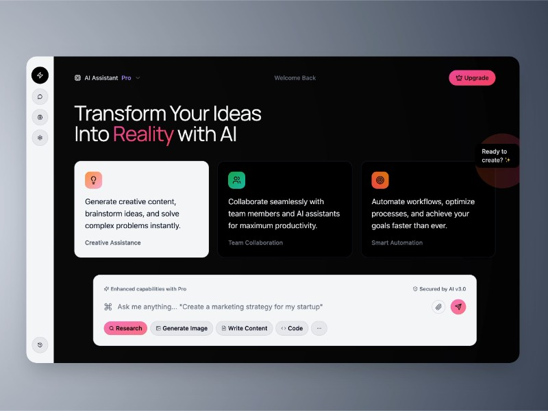

# Interactive Sidebar Navigation Panel

A responsive UI featuring a blurred backdrop card with a vertical sidebar of icon buttons using Tailwind CSS and Lucide icons.

## 🔗 Links
- **Live Website Demo:** [https://1FIP0GJ.aura.build/](https://1FIP0GJ.aura.build/)

## Project Details
- **Slug:** `1FIP0GJ`
- **Views:** 1201
- **Tags:** Sidebar, Navigation, Tailwind CSS, Lucide Icons, Responsive Design, Animation
- **Template Type:** Vite-React Project (Compiled from static HTML)

## How to Run
1. Open this folder in your terminal / VS Code.
2. Run `npm install`.
3. Run `npm run dev`.
