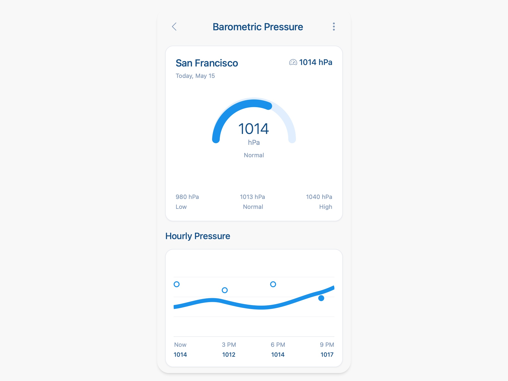

# Barometric Pressure Monitoring UI

Responsive UI displaying current, hourly, and 7-day barometric pressure with gauge and charts using Tailwind CSS.

## 🔗 Links
- **Live Website Demo:** [https://1a861eE.aura.build/](https://1a861eE.aura.build/)

## Project Details
- **Slug:** `1a861eE`
- **Views:** 21
- **Tags:** Pressure Gauge, Barometric Pressure, Tailwind CSS, SVG Chart, Responsive Design, Data Visualization
- **Template Type:** Vite-React Project (Compiled from static HTML)

## How to Run
1. Open this folder in your terminal / VS Code.
2. Run `npm install`.
3. Run `npm run dev`.
