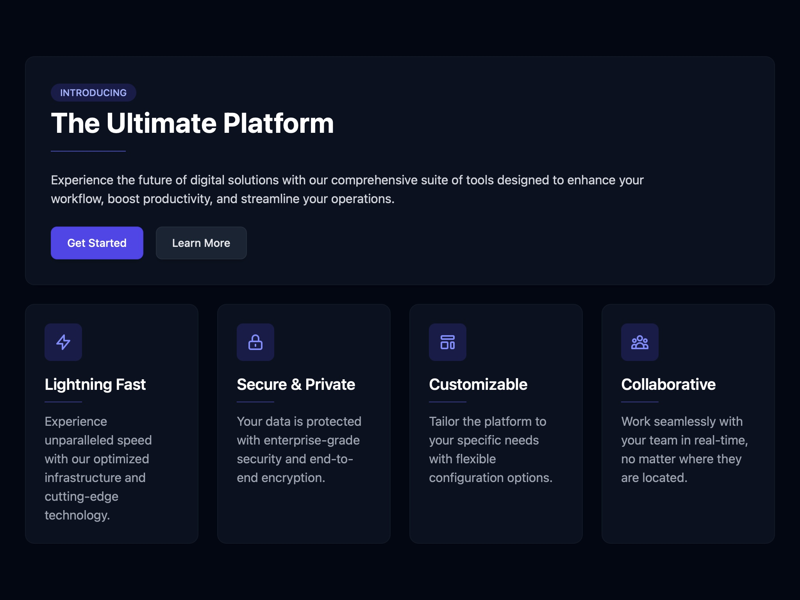

# Platform Features Showcase Layout

Responsive UI highlighting key platform features with animated meteor background and interactive feature cards using Tailwind CSS.

## 🔗 Links
- **Live Website Demo:** [https://1dNur5.aura.build/](https://1dNur5.aura.build/)

## Project Details
- **Slug:** `1dNur5`
- **Views:** 89
- **Tags:** Feature Cards, Animation, Tailwind CSS, Responsive Design, UI Layout
- **Template Type:** Vite-React Project (Compiled from static HTML)

## How to Run
1. Open this folder in your terminal / VS Code.
2. Run `npm install`.
3. Run `npm run dev`.
