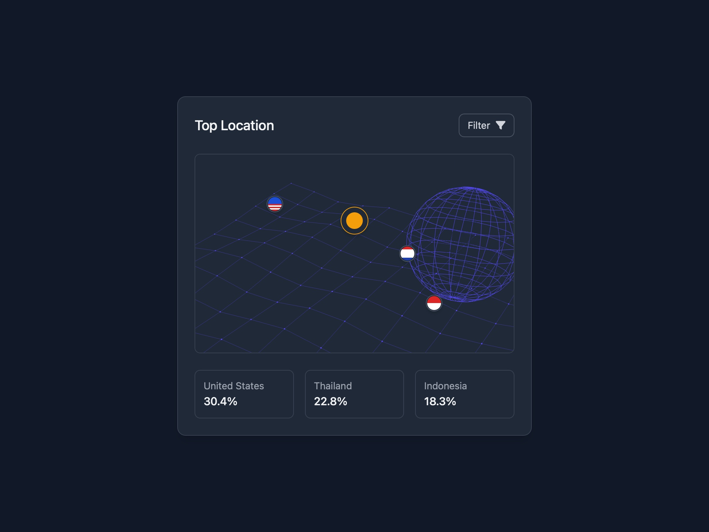

# Interactive Globe with Location Stats

Displays an interactive 3D globe with location markers and percentage stats using Vanta.js and Tailwind CSS.

## 🔗 Links
- **Live Website Demo:** [https://1dxVvk.aura.build/](https://1dxVvk.aura.build/)

## Project Details
- **Slug:** `1dxVvk`
- **Views:** 2320
- **Tags:** Interactive Globe, Location Markers, Vanta.js, Tailwind CSS, 3D Visualization, Stats Display
- **Template Type:** Vite-React Project (Compiled from static HTML)

## How to Run
1. Open this folder in your terminal / VS Code.
2. Run `npm install`.
3. Run `npm run dev`.
